<div align="center">

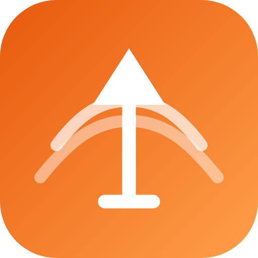

# TOPO APP

**Topografía de campo y gabinete en tu Android: nivelación, control de capas, puntos, cálculos e informes listos para supervisión — sin internet.**


</div>

<p align="center">
  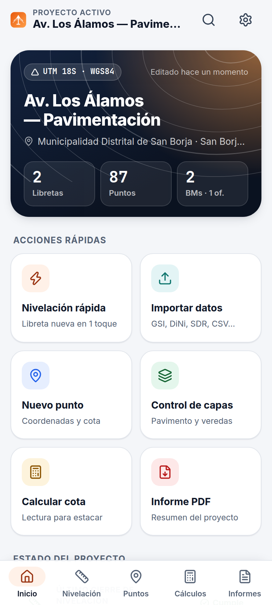
  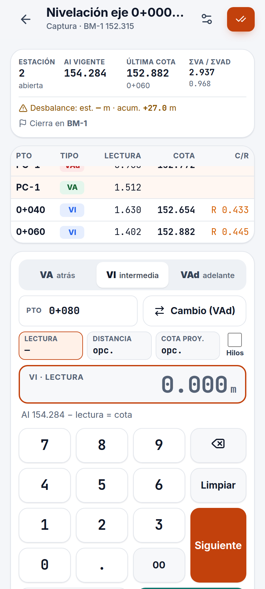
  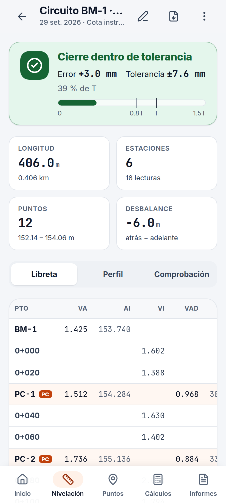
  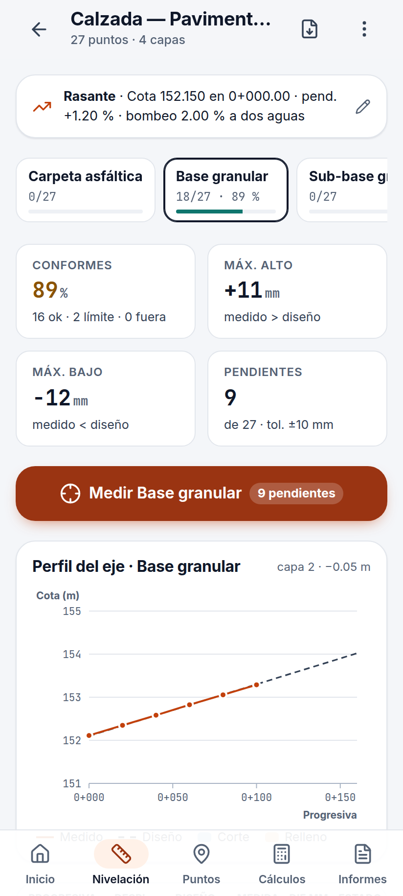
</p>

---

## ¿Qué es?

TOPO APP reemplaza la libreta de papel y las hojas de Excel del topógrafo de obra. Registras las lecturas en campo con un teclado grande, y la app calcula cotas, comprueba la aritmética y te dice **en el momento** si el cierre está dentro de tolerancia, cuando todavía puedes repetir la nivelación. Después genera el **PDF y el Excel** para la supervisión con dos toques.

Está pensada para obra peruana: pavimentación, veredas, saneamiento y edificaciones. Usa terminología local, UTM WGS84 en las zonas 17S, 18S y 19S, y tolerancias de **IGN, FGCS y MTC EG-2013**.

## Funciones

| Módulo | Qué hace |
|---|---|
| **Nivelación** | Libreta digital por cota instrumental o por ascensos/descensos, con puntos de cambio, intermedias y lecturas de tres hilos.<br>Comprobación aritmética `ΣVA − ΣVAd = ΣS − ΣB`.<br>Cierre con semáforo frente a `T = e·√K` (1.er, 2.º, 3.er orden, ordinaria o personalizada).<br>Compensación proporcional, balance de distancias, cota de proyecto con corte/relleno y perfil gráfico. |
| **Control de capas** | Paquete de capas con plantillas: flexible urbano, rígido, vereda y afirmado.<br>Rasante por pendientes con bombeo y malla de control automática.<br>Captura «con nivel», que muestra en vivo la lectura objetivo.<br>Desviaciones con estado CONFORME / AL LÍMITE / NO CONFORME y estadísticas. |
| **Puntos** | Lista con buscador y filtro por código.<br>Vista en planta interactiva con zoom, curvas de nivel y medición entre puntos.<br>Radiación desde la estación total y captura con el GPS del teléfono.<br>Cuadro de BMs, superficie TIN y volumen de corte/relleno. |
| **Cálculos** | Lectura objetivo/cota, prueba de dos estacas, taquimetría, curvatura y refracción, nivelación recíproca y pendiente de tuberías.<br>Inverso, radiación, UTM ↔ geográficas, intersecciones, poligonal (Bowditch y tránsito), área, curva horizontal, volúmenes, pendientes y ángulos. |
| **Informes** | En PDF: libreta de nivelación, protocolo de control de capas, cuadro de BMs y puntos, e informe de control topográfico.<br>Excel del proyecto completo.<br>Membrete configurable: empresa, ingeniero y CIP. |
| **Datos** | **Importa** desde niveles digitales y estaciones: Leica GSI-8/16 (LS10/LS15/DNA03/Sprinter/TS), Trimble DiNi (.dat), Sokkia SDR33, Topcon, NMEA (GNSS) y CSV/TXT.<br>**Exporta** a CSV, Excel, DXF (AutoCAD/Civil 3D), KML (Google Earth), LandXML, GSI-16 y respaldo `.topo.json`. |
| **Sistema** | 100 % offline y autoguardado.<br>Temas claro, oscuro y **sol** (alto contraste a pleno sol).<br>Botones grandes para usar con guantes y botón *atrás* nativo.<br>Diseño adaptable: celular, tablet y PC. |

## Capturas

| Inicio | Nivelación | Captura de campo | Resultado |
|---|---|---|---|
|  | 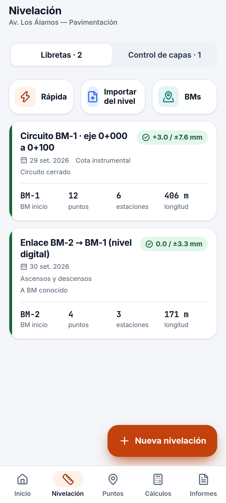 |  |  |

| Perfil | Control de capas | Planta de puntos | Cálculos |
|---|---|---|---|
| 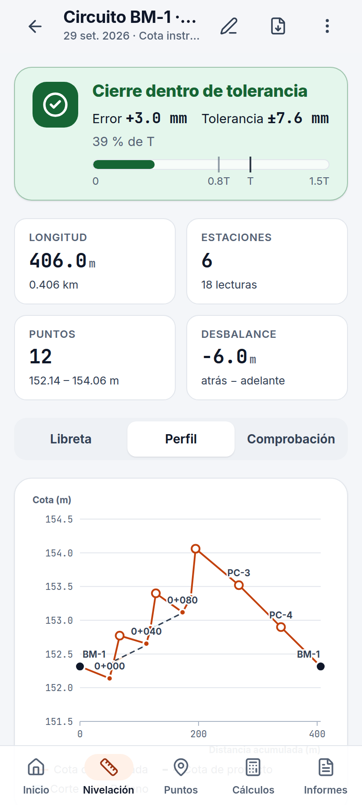 |  | 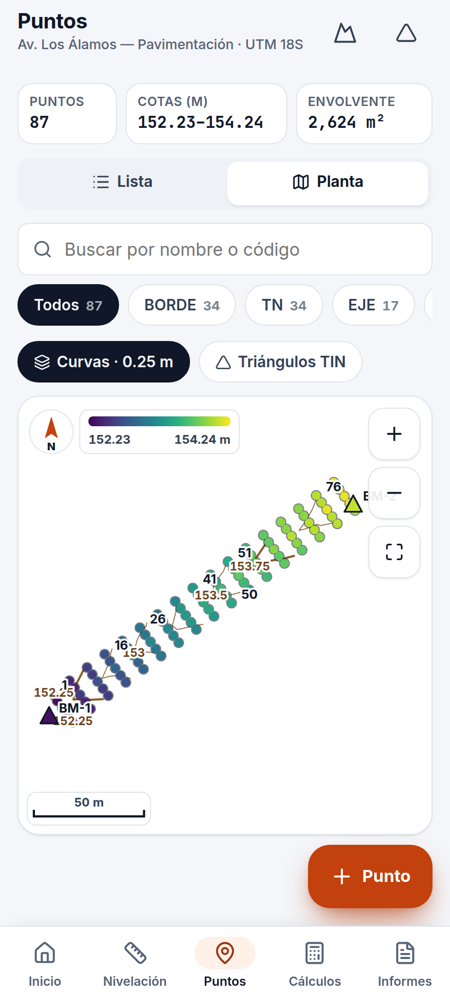 | 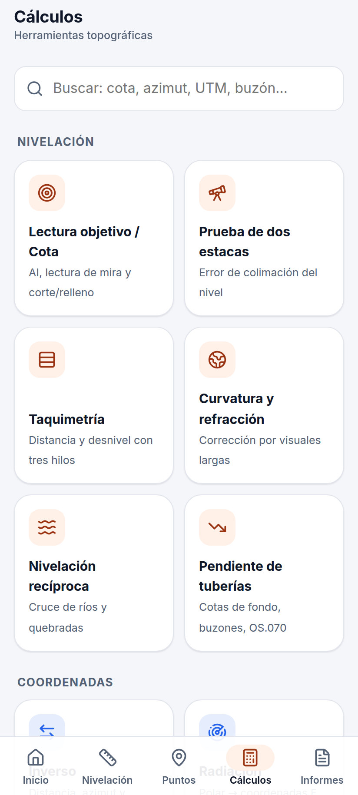 |

| Herramienta | Importar | Informes | Modo oscuro |
|---|---|---|---|
| 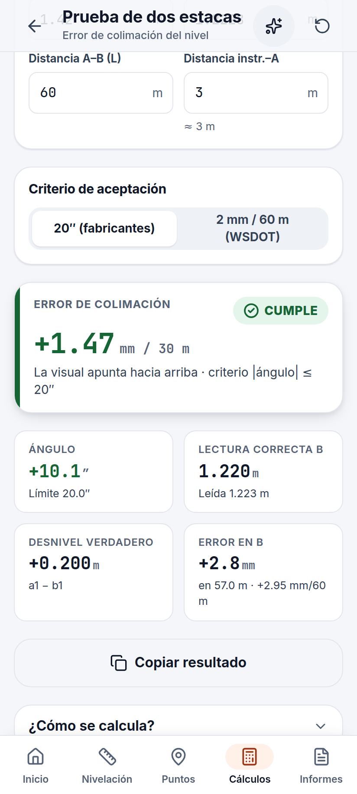 | 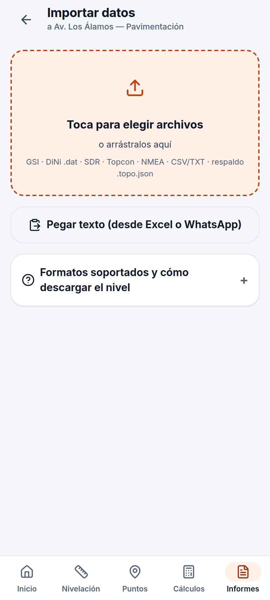 | 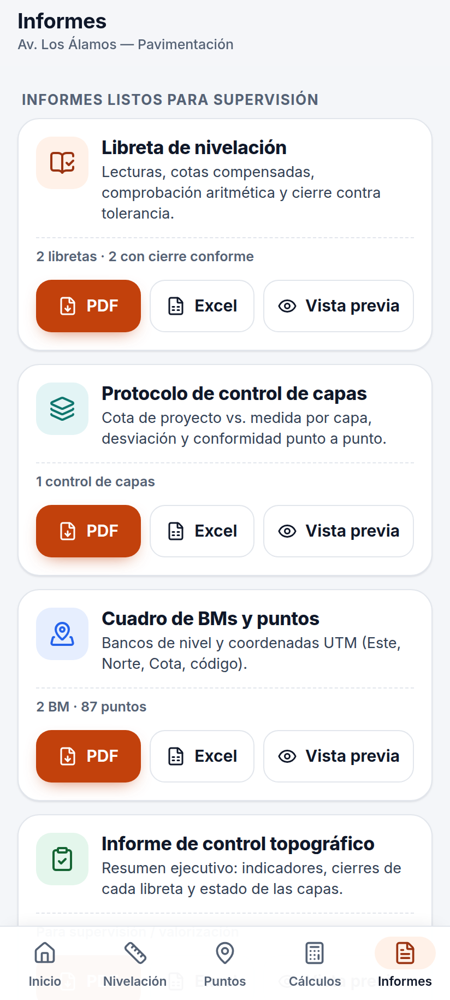 | 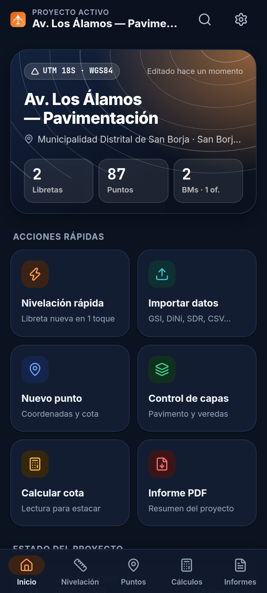 |

<p align="center">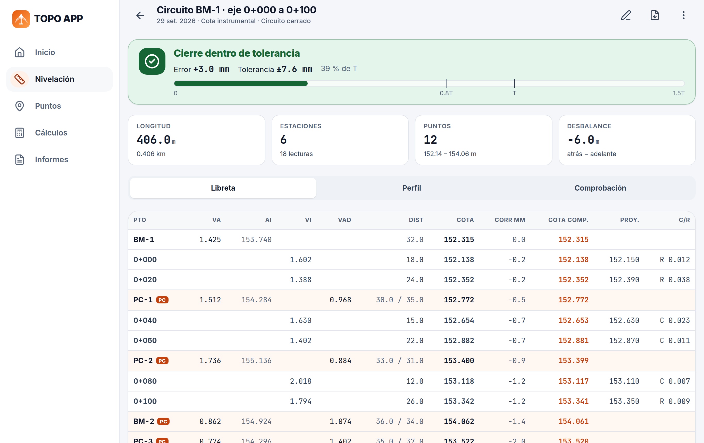</p>

## Informes de ejemplo

Generados con el proyecto de ejemplo incluido en la app:

| Libreta de nivelación | Protocolo de capas | Cuadro de puntos | Control topográfico |
|---|---|---|---|
| [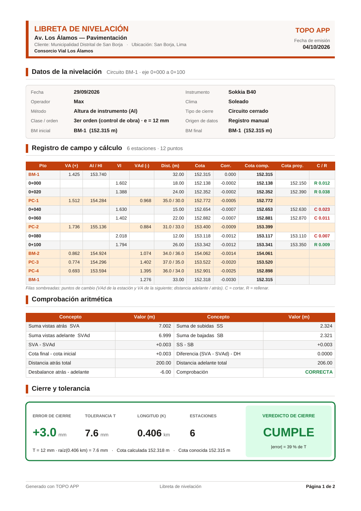](docs/ejemplos/libreta-nivelacion.pdf) | [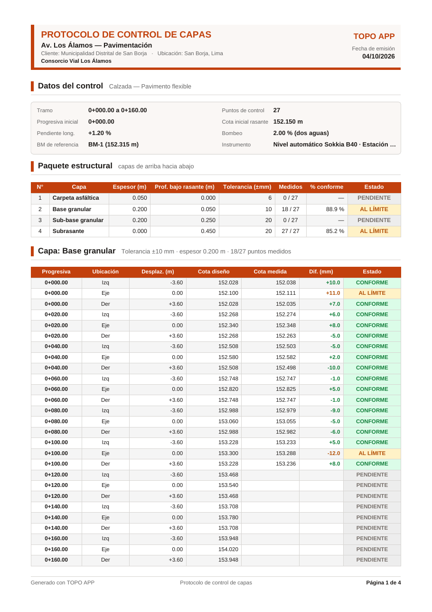](docs/ejemplos/protocolo-capas.pdf) | [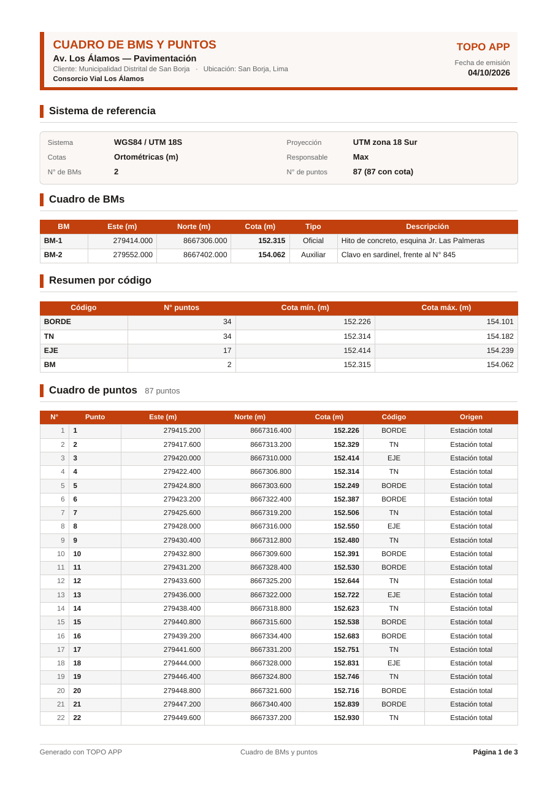](docs/ejemplos/cuadro-puntos.pdf) | [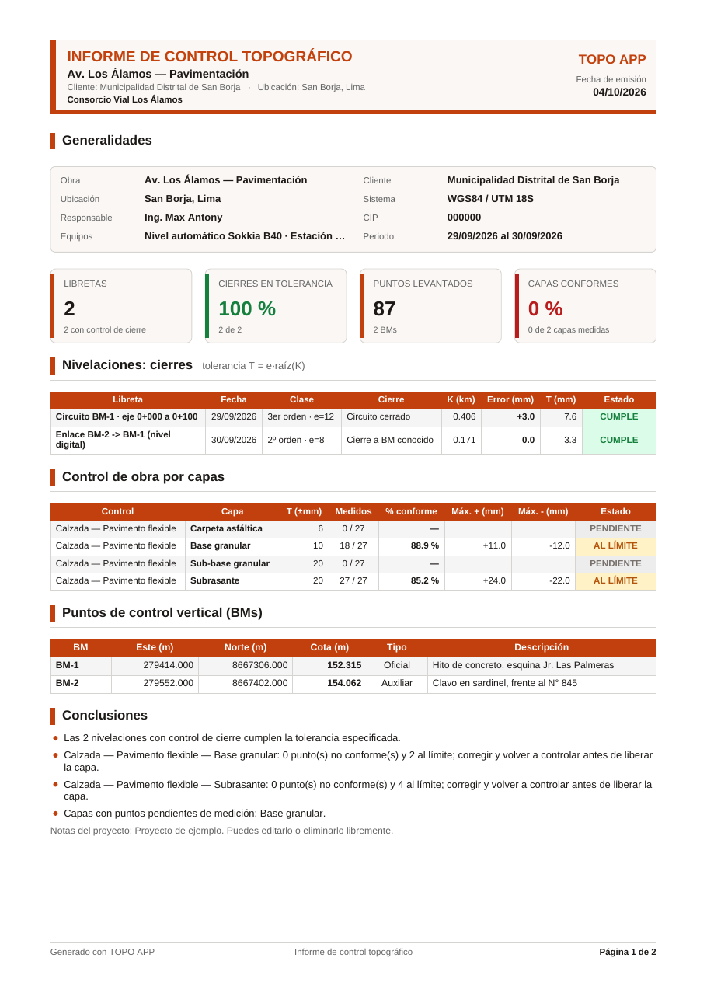](docs/ejemplos/informe-control-topografico.pdf) |

También hay un [Excel del proyecto completo](docs/ejemplos/proyecto.xlsx).

## Instalar en Android

1. Ve a la pestaña **Actions** del repositorio, abre la última ejecución de **CI** y descarga el artefacto `topo-app-debug-apk`.
2. Copia el `.apk` al teléfono y ábrelo. Android pedirá permitir «instalar apps de origen desconocido».

Para compilarlo tú mismo hace falta Node 22, JDK 21 y el Android SDK:

```bash
npm ci
npm run build
npx cap sync android
cd android && ./gradlew assembleDebug
# → android/app/build/outputs/apk/debug/app-debug.apk
```

## Desarrollo

```bash
npm install
npm run dev          # servidor local en http://localhost:5173
npm test             # tests del motor de cálculo, importadores e informes
npm run typecheck    # TypeScript estricto
npm run build        # build de producción en dist/
npm run screenshots  # regenera las capturas del README
```

### Arquitectura

```
src/
├── core/        motor de cálculo puro, sin DOM y con tests
│   ├── leveling/   libreta, cierre, tolerancias, compensación, prueba de dos estacas, taquimetría
│   ├── cogo/       inverso, radiación, intersecciones, poligonal, curvas, áreas
│   ├── geo/        UTM ↔ WGS84 (Krüger), factor de escala combinado
│   ├── surface/    TIN (Delaunay), curvas de nivel, volúmenes, perfiles, pendientes
│   ├── pavement/   rasante, capas, verificación de tolerancias, plantillas
│   └── units/      ángulos (DMS, gon, rad) y pendientes
├── io/          importadores (GSI, DiNi, SDR, Topcon, NMEA, CSV) y exportadores (CSV, DXF, KML, LandXML, GSI)
├── report/      generación de PDF (jsPDF) y Excel (SheetJS)
├── ui/          kit de componentes, gráficos SVG (perfil, planta), formato numérico
├── app/         estado (zustand + autoguardado), navegación, plataforma (archivos, GPS)
└── features/    pantallas: home · leveling · points · tools · reports
```

Regla de dependencias: `core` no importa nada; `io` y `report` dependen solo de `core`; las pantallas lo juntan todo. Los datos crudos (lecturas, coordenadas medidas) nunca se sobrescriben: cotas, cierres y compensaciones se recalculan siempre.

## Estudios previos

El diseño se basa en cuatro estudios, en [`docs/estudio/`](docs/estudio):

- [Informe consolidado y plan de funciones](docs/estudio/00-informe-consolidado.md)
- [Estudio de mercado](docs/estudio/01-estudio-de-mercado.md): competidores, precios, mercado peruano y brechas
- [Estudio funcional de campo](docs/estudio/02-estudio-funcional-campo.md): tareas del topógrafo, fórmulas y tolerancias
- [Formatos de datos de equipos](docs/estudio/03-formatos-de-datos-equipos.md): especificaciones de GSI, DiNi, SDR, NMEA, DXF y LandXML
- [Estudio UX/UI](docs/estudio/04-estudio-ux-ui.md): principios para apps de campo y sistema de diseño

## Hoja de ruta

- [ ] Conexión Bluetooth SPP con niveles digitales, estaciones totales y GNSS
- [ ] Visor 3D de superficies y capas
- [ ] Alturas ortométricas con EGM2008
- [ ] Ajuste por mínimos cuadrados de redes de nivelación
- [ ] Sincronización en la nube y licencias por empresa

## Normativa de referencia

RNE CE.010 Pavimentos urbanos · RNE CE.040 Drenaje pluvial · OS.070 Redes de aguas residuales · MTC EG-2013 · IGN Perú (Norma técnica geodésica) · FGCS.

> Los valores por defecto marcados como «tanteo» no son normativos: revísalos contra el expediente técnico de cada obra.

---

<div align="center">Hecho en Perú 🇵🇪 para topógrafos de obra.</div>
